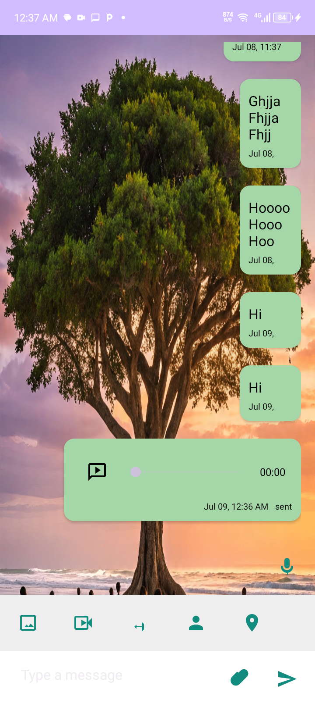
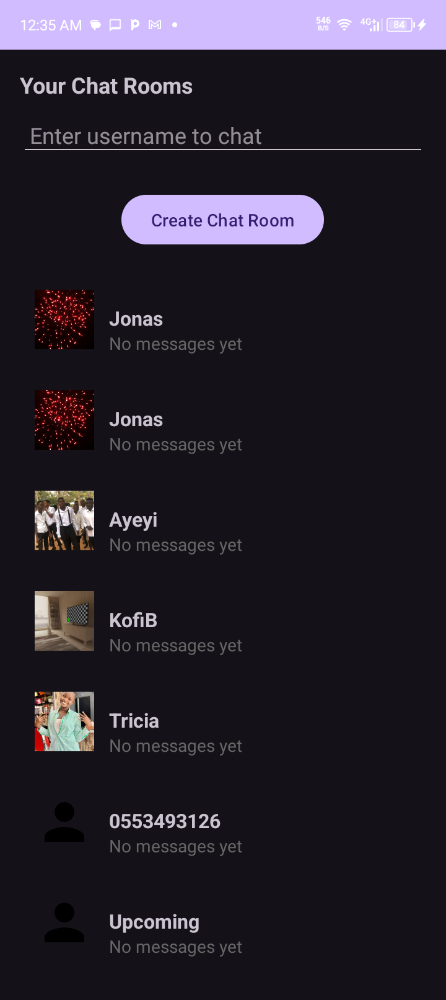

---

# YenkasaChat

**YenkasaChat** is a modern Android chat application built with Kotlin. It supports real-time messaging with multimedia sharing — including photos, videos, audio, documents, location, and contacts. Designed with a clean interface and robust backend, it's ideal for both casual and professional communication.

---

## 🌟 Features

- 🔁 Real-time chat with history
- 🖼️ Send images and videos (via Cloudinary)
- 🎙️ Record and send audio messages
- 📍 Share current location
- 📂 Share documents and contact info
- 🔔 Push notifications via Firebase FCM
- ✅ User verification with JWT and Twilio
- 📦 Modular architecture with Kotlin
- 📲 Clean UI with preview support for all attachments

---

## 📽 Demo Videos

- [📱 Chat functionality demo](./Screen_Recording_20250709_003711.mp4)
- [👤 User info and verification demo](./Screen_Recording_20250709_002406.mp4)

---

## 🖼 Screenshots

| Chat Interface | Account Info | Attachments |
|----------------|--------------|-------------|
|  |  |  |

---

## ⚙ Installation & Setup

1. Clone the repository:
   ```bash
   git clone https://github.com/FerochiDenarius/yenkasaChat.git

2. Open it in Android Studio


3. Add your Cloudinary credentials to gradle.properties:

CLOUDINARY_CLOUD_NAME=your-cloud-name
CLOUDINARY_API_KEY=your-api-key
CLOUDINARY_API_SECRET=your-api-secret


4. Connect your emulator or Android device


5. Build and run the project


---

🧰 Technologies Used

Frontend: Kotlin (Jetpack Compose & XML)

Backend: Node.js with MongoDB

Media Uploads: Cloudinary

Notifications: Firebase Cloud Messaging (FCM)

Authentication: JWT & Twilio

Database: MongoDB Atlas


---

🙌 Contributing

Contributions are welcome! Feel free to fork this repo and submit a pull request.

Suggestions, feature requests, and bug reports are also appreciated. You can:

Fix bugs

Improve UI/UX

Add new features

Refactor or optimize code


---

📞 Contact

Have questions, feedback, or want to collaborate?

Reach me via WhatsApp: +233 537 044 801


---

📄 License

This project is licensed under the MIT License — feel free to use, modify, and distribute it.


---

-
