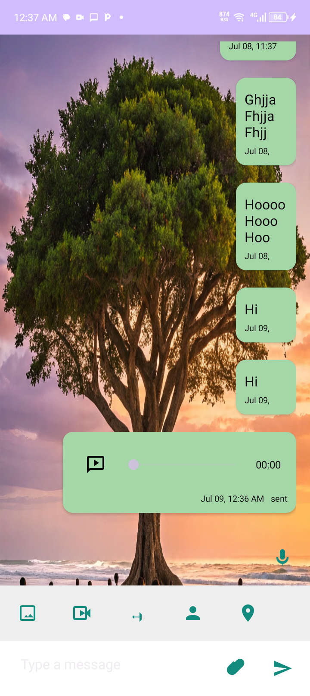
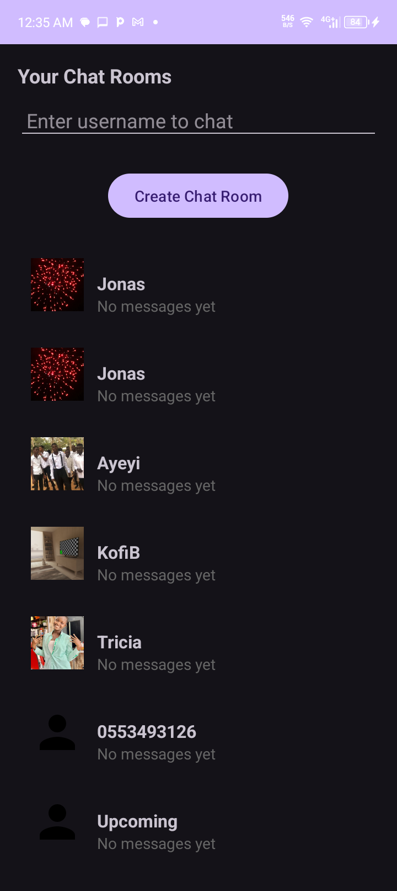

---

# YenkasaChat

YenkasaChat is a community-driven social platform that helps you discover 
local and interest-based communities, share meaningful content, engage with 
others, and earn rewards for your activity. Whether you want to explore 
your city, follow your interests, meet new people, or build a community, 
Yenkasa gives you a place to connect—and get rewarded for it.

EXPLORE COMMUNITIES
• Find local communities around your area  
• Join interest-based groups and discussions  
• Discover trending topics and creators  
• Follow people and communities you care about  

SHARE & EARN WITH YKC REWARDS
• Earn YKC coins for posting valuable content  
• Receive rewards for engaging with posts  
• Watch sponsored ads from brands and earn coins  
• Build your reputation and influence in the community  

CREATE CONTENT THAT MATTERS
• Share photos, videos, updates and community stories  
• Support local creators and emerging voices  
• Spark discussions through comments and interactions  

SOCIAL FEATURES
• Like, comment and share posts  
• View detailed creator profiles  
• Connect with people in your interest circles  

COMMUNICATION FEATURES (OPTIONAL)
• Send messages to friends and followers  
• Share images, audio and location inside chats  
• Use chat when needed—community content remains the core focus  

SAFETY & MODERATION
• Block and report users or content  
• Automated checks and human review  
• Transparent community guidelines  
• User-controlled privacy features  

REWARDS & ADVERTISING
• Optional rewarded ads for earning extra YKC  
• Local business promotions integrated in the feed  
• Your data is never sold  

YenkasaChat brings communities together—local or global—while giving 
everyone a chance to grow, belong and earn from meaningful engagement.

Join your community. Join Yenkasa.


---

## 🌟 Features

- 🔁 Real-time chat with history
- 🖼️ Send images and videos (via Cloudinary)
- 🎙️ Record and send audio messages
- 📍 Share current location
- 📂 Share documents and contact info
- 🔔 Push notifications via Firebase FCM
- ✅ User verification with JWT and Twilio
- 📦 Modular architecture with Kotlin
- 📲 Clean UI with preview support for all attachments

---

## 📽 Demo Videos

- [📱 Chat functionality demo](./Screen_Recording_20250709_003711.mp4)
- [👤 User info and verification demo](./Screen_Recording_20250709_002406.mp4)

---

## 🖼 Screenshots

| Chat Interface | Account Info | Attachments |
|----------------|--------------|-------------|
|  |  |  |

---

## ⚙ Installation & Setup

1. Clone the repository:
   ```bash
   git clone https://github.com/FerochiDenarius/yenkasaChat.git

2. Open it in Android Studio


3. Add your Cloudinary credentials to gradle.properties:

CLOUDINARY_CLOUD_NAME=your-cloud-name
CLOUDINARY_API_KEY=your-api-key
CLOUDINARY_API_SECRET=your-api-secret


4. Connect your emulator or Android device


5. Build and run the project


---

🧰 Technologies Used

Frontend: Kotlin (Jetpack Compose & XML)

Backend: Node.js with MongoDB

Media Uploads: Cloudinary

Notifications: Firebase Cloud Messaging (FCM)

Authentication: JWT & Twilio

Database: MongoDB Atlas


---

🙌 Contributing

Contributions are welcome! Feel free to fork this repo and submit a pull request.

Suggestions, feature requests, and bug reports are also appreciated. You can:

Fix bugs

Improve UI/UX

Add new features

Refactor or optimize code


---

📞 Contact

Have questions, feedback, or want to collaborate?

Reach me via WhatsApp: +233 537 044 801


---

📄 License

This project is licensed under the MIT License — feel free to use, modify, and distribute it.


---

-
