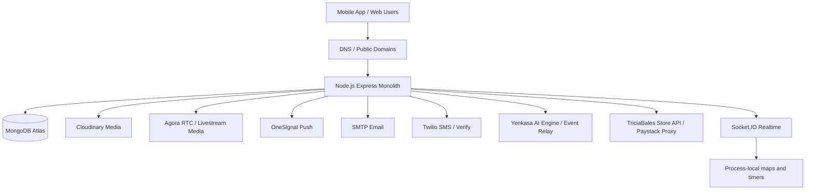
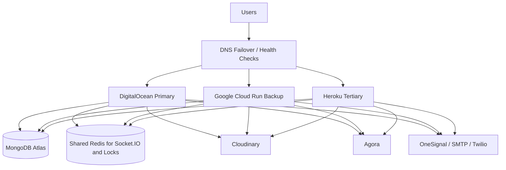

# Yenkasa Multi-Cloud Backup Readiness Audit

Date: 2026-06-11

Backend audited: `/Users/kofibright/yenkasaChat/yenkasaChatBackend/RegLoginBackend`

Objective: prepare Yenkasa App for active-passive failover with DigitalOcean as primary, Google Cloud Run as secondary, and Heroku as tertiary.

## Executive Summary

Yenkasa can be made multi-cloud ready, but it is not ready for safe failover today.

The core database and media choices are mostly portable because MongoDB Atlas, Cloudinary, Agora, OneSignal, SMTP, and external AI services are not tied to one hosting provider. A server move should not require a database migration if every provider has valid secrets and network access to Atlas.

The main failover blocker is realtime state. Socket.IO presence, livestream participation, timers, dedupe maps, and some lifecycle state are currently process-local. If traffic moves to a new server, or if more than one instance runs, online state, viewer counts, livestream events, and call/signaling behavior can fragment unless Socket.IO is backed by Redis and process-local maps are replaced with shared state.

The second major blocker is deployment hygiene. The repository has no provider-neutral `Dockerfile`, `Procfile`, Cloud Run config, or Heroku config at the audited root. There is an Azure deployment script with hardcoded production-like secrets, and local upload fallbacks exist when Cloudinary is missing.

## Current Production Dependency Map

Target failover shape:

## Part 1: Current Infrastructure Inventory

### Backend Services

- Main runtime: Node.js Express app started by `server.js`, which loads `src/server.js`.
- API app: `src/app.js`.
- API route registry: `src/config/apiRoutes.js`.
- Realtime: Socket.IO attached to the HTTP server in `src/server.js`.
- Static/web/store/blog routes are served by the same backend process.
- Background work starts inside the web process:
  - verification scheduler
  - monthly YKC reset scheduler
  - AI intelligence event relay
  - inline moderation workers unless disabled
  - inline YME workers unless disabled

### Databases

- MongoDB via Mongoose and `MONGODB_URI`.
- MongoDB stores user accounts, tokens/revocation timestamps, social graph, posts, communities, moderation, rewards, livestream session state, and many operational records.
- No separate server-side session database was identified.

### Storage Providers

- Cloudinary is the intended source of truth for user media.
- Local upload fallback exists in some code paths and must be removed or made fail-closed before multi-cloud deployment.
- Public static assets are served from the backend repository/image.

### Video and Livestream Services

- Agora provides RTC media transport.
- Backend generates Agora tokens and controls room lifecycle, permissions, guest seats, comments, reactions, viewer counts, and livestream business rules.
- Livestream coordination depends heavily on backend HTTP plus Socket.IO.

### Notification Providers

- OneSignal for push notifications.
- SMTP for email.
- Twilio appears configured for SMS/verification.
- Firebase Admin dependency exists and should be verified if FCM server credentials are used outside the currently scanned paths.

### Authentication Providers

- JWT access and refresh tokens.
- Refresh token and revocation state are stored on user documents in MongoDB.
- Email verification/reset routes are in the backend.

### DNS Configuration

- Code references `https://www.yenkasa.xyz` and `FRONTEND_URL`.
- DNS provider and current production records were not verified because the local DigitalOcean token check returned unauthorized.
- DNS failover will require confirmed control of production API and realtime hostnames.

## Part 2: Environment Audit

### Critical Environment Variables

- `MONGODB_URI`
- `ACCESS_TOKEN_SECRET`
- `REFRESH_TOKEN_SECRET`
- `JWT_SECRET` if legacy auth config is still used
- `CLOUDINARY_CLOUD_NAME`
- `CLOUDINARY_API_KEY`
- `CLOUDINARY_API_SECRET`
- `AGORA_APP_ID`
- `AGORA_APP_CERTIFICATE`
- `AGORA_TOKEN_TTL_SECONDS`
- `ONESIGNAL_APP_ID`
- OneSignal REST API key, accepted by code under names including `YenkasaApiKey`, `ONESIGNAL_REST_API_KEY`, `ONESIGNAL_API_KEY`, `ONESIGNAL_KEY`, and `yenkasachatOneSignalKey`
- `SMTP_HOST`
- `SMTP_PORT`
- `SMTP_SECURE`
- `EMAIL_USER`
- `EMAIL_PASS`
- `EMAIL_FROM`
- `TWILIO_SID`
- `TWILIO_AUTH`
- `TWILIO_PHONE`
- `TWILIO_VERIFY_SID`
- `YENKASA_AI_ENGINE_URL`
- `YENKASA_AI_EVENT_API_KEY`
- `INTERNAL_PLATFORM_API_KEY` or `LOG_INGEST_API_KEY` if those paths are active
- `TRICIABALES_API_BASE`
- Redis config for production realtime and queues, preferably `REDIS_URL` or a single provider-neutral URL

### Optional or Operational Variables

- `NODE_ENV`
- `PORT`
- `CLIENT_URL`
- `FRONTEND_URL`
- `PUBLIC_BASE_URL`
- `ACCESS_EXPIRES_IN`
- `REFRESH_EXPIRES_IN`
- `SOCKET_OFFLINE_GRACE_MS`
- `CHAT_LAUGH_REACTION_COOLDOWN_MS`
- `LIVESTREAM_HOST_DISCONNECT_GRACE_MS`
- `LIVESTREAM_EVENT_DEDUPE_TTL_MS`
- `LIVESTREAM_STARTUP_GRACE_MS`
- `YENKASA_ENABLE_INLINE_MODERATION_WORKERS`
- `YENKASA_ENABLE_INLINE_YME_WORKERS`
- `YENKASA_MODERATION_QUEUE_MODE`
- `YENKASA_MODERATION_QUEUE_ENABLED`
- `YENKASA_YME_*` tuning variables
- `ANDROID_PLAY_STORE_URL`
- `ANDROID_LATEST_VERSION_CODE`
- `ANDROID_LATEST_VERSION_NAME`
- `ANDROID_UPDATE_MESSAGE`
- `CLOUDINARY_*_FOLDER`
- reward cap and geo lookup tuning variables

### Missing or Risky Configuration

- Redis variables were not present in the local `.env` key list, which means multi-instance Socket.IO and durable queues are not ready by default.
- `TRICIABALES_API_BASE` was not present in the local `.env`; code falls back to a hardcoded IP URL.
- `CLIENT_URL` was not present in the local `.env`; Socket.IO CORS can fall back to permissive behavior.
- `JWT_SECRET` was referenced by legacy auth config but was not present in the local `.env` key list.
- Paystack secrets were not found in this backend because the store/payment flow proxies to another API. That downstream API must be audited separately.
- Hardcoded production-like secrets were found in deployment/support files. They should be rotated and removed from the repository.

## Part 3: Database Failover Audit

MongoDB Atlas is already cloud-independent in principle. DigitalOcean, Cloud Run, and Heroku can all connect to the same Atlas cluster if secrets and network allowlists permit it.

A server migration should not require database migration.

Required checks before failover:

- Atlas network access allows DigitalOcean, GCP, and Heroku egress. If IP allowlisting is strict, configure static egress per provider or allow appropriate CIDR ranges.
- Atlas backups and point-in-time recovery are enabled.
- `MONGODB_URI` is identical or intentionally equivalent across all providers.
- Connection pool settings are safe for Cloud Run autoscaling and Heroku dyno counts.
- Any migration or seeding logic is idempotent.

Session state:

- Authentication is JWT based.
- Refresh token and revocation timestamps live in MongoDB user documents.
- Server migration should not invalidate sessions if JWT secrets and MongoDB remain the same.

Uploads:

- Upload metadata can live in MongoDB.
- Binary user media should remain in Cloudinary, not MongoDB and not local disk.

## Part 4: Media Storage Audit

Cloudinary is the right source of truth for multi-cloud failover.

Expected failover behavior:

- If traffic moves from DigitalOcean to GCP or Heroku, media URLs remain valid because they point to Cloudinary.
- MongoDB continues storing metadata and Cloudinary public IDs.

Risks found:

- `utils/upload.js` uses local disk upload storage.
- Store logo upload logic can fall back to `uploads/store/...` when Cloudinary is missing.
- AI ingest routes use temporary directories under OS temp paths. This is acceptable only for ephemeral processing, not durable storage.

Required changes:

- Remove local upload fallback for production.
- If Cloudinary config is missing, reject upload requests with a clear operational error.
- Ensure backup providers have identical Cloudinary secrets.
- Keep generated thumbnails/transforms in Cloudinary, not server disk.

## Part 5: Livestream Audit

Agora handles media transport, so the media path itself is not tied to DigitalOcean.

Backend responsibilities:

- Token generation using Agora app ID/certificate.
- Livestream creation/join/end/leave/gift endpoints.
- Host readiness and heartbeat events.
- Comments, reactions, guest seat state, moderation, and viewer counts.
- Socket.IO room fanout.

Failover requirements:

- Same Agora secrets on all providers.
- Stable public API and realtime hostnames.
- Callback/webhook URLs, if configured in Agora console, must point to failover-capable DNS names instead of provider-specific URLs.
- Livestream state must be shared in MongoDB/Redis, not only process memory.

## Part 6: Socket.IO Audit

This is the highest failover risk.

Current model:

- Socket.IO is attached to the same Node process as Express.
- Presence, room membership helpers, live participant state, dedupe maps, timers, and several realtime workflows use process-local memory or globals.
- No Redis Socket.IO adapter was confirmed as active.

Impact:

- More than one backend instance can split online presence and livestream state.
- Failover during an active call/livestream can disconnect users or lose room metadata.
- Cloud Run autoscaling and Heroku multi-dyno operation can fragment realtime behavior.

Required changes:

- Add `@socket.io/redis-adapter`.
- Use shared Redis for Socket.IO pub/sub.
- Move online user maps, livestream participant state, dedupe TTLs, cooldowns, and host grace timers to Redis or MongoDB-backed state.
- Add distributed locks for scheduled jobs.
- Use one stable realtime hostname, such as `realtime.yenkasa.xyz`.
- For Cloud Run, configure websocket support carefully and consider minimum instances for the active realtime target.
- For Heroku, use paid dynos and Redis if more than one dyno is possible.

## Part 7: Heroku Readiness

Current status:

- Node engine is `20.x`, which is compatible with Heroku Node buildpack.
- `npm start` runs `node server.js`.
- No `Procfile` was found at the audited root.
- No Heroku-specific release or worker process file was found.

Heroku checklist:

- Add `Procfile`:
  - `web: node server.js`
  - optional separate workers after queues are split
- Set all critical config vars in Heroku.
- Use a paid dyno for reliable standby behavior. Free/sleeping behavior is not acceptable for failover.
- Add Heroku Redis or external Redis.
- Verify websocket behavior with Socket.IO transport.
- Disable duplicate inline workers on passive standby unless failover is active.
- Ensure `PORT` is provided by Heroku and the app binds to it.
- Run health checks against `/health`.

## Part 8: Google Cloud Run Readiness

Current status:

- No provider-neutral `Dockerfile` or Cloud Run config was found at the audited root.
- App listens on `PORT || 8080`, which is compatible with Cloud Run.
- Local disk usage exists but should only be ephemeral.

Cloud Run checklist:

- Add a production `Dockerfile`.
- Store secrets in Secret Manager and mount/inject them as environment variables.
- Set concurrency and timeout intentionally for long-lived websocket traffic.
- Consider `min-instances=1` for active realtime service, or keep backup at zero and accept cold start for passive failover.
- Use shared Redis for Socket.IO and locks.
- Avoid local persistent writes.
- Split web service from background workers where possible.
- Confirm `/health` returns quickly without requiring downstream dependencies that may timeout.

## Part 9: Recommended Failover Design

Primary: DigitalOcean.

Secondary: Google Cloud Run.

Tertiary: Heroku.

Design:

- Use Cloudflare Load Balancing or equivalent DNS failover with health checks.
- Keep stable hostnames:
  - `api.yenkasa.xyz`
  - `realtime.yenkasa.xyz`
  - `www.yenkasa.xyz`
- MongoDB Atlas remains the database source of truth.
- Cloudinary remains the media source of truth.
- Agora remains RTC media transport.
- OneSignal, SMTP, and Twilio remain external notification providers.
- Redis becomes the shared realtime/session coordination layer.
- Background jobs run in dedicated worker processes with leader election or distributed locks.

Operational model:

1. DigitalOcean receives normal traffic.
2. GCP Cloud Run is deployed with the same image/config and health checked.
3. Heroku is deployed as tertiary with matching config vars.
4. Backups are passive until health checks fail.
5. DNS failover moves traffic to GCP first, then Heroku.
6. Failback is manual after verification to avoid split-brain realtime state.

## Part 10: Risk Assessment

### Single Points of Failure

- MongoDB Atlas cluster and account.
- Cloudinary account.
- Agora account/project.
- OneSignal account/API key.
- Store/Paystack proxy target behind `TRICIABALES_API_BASE`.
- DNS provider.
- Redis, once introduced for realtime coordination.

### Services That Cannot Safely Fail Over Today

- Socket.IO realtime behavior during active calls/livestreams.
- Livestream participant/viewer state.
- Background schedulers if multiple providers run them at the same time.
- Upload paths that fall back to local disk.
- Store/payment proxy if the hardcoded IP target is unavailable.

### Data Loss Risks

- Local upload fallback can lose files on redeploy or provider change.
- Process-local realtime maps can lose live state during failover.
- Duplicate workers can double-process rewards, moderation, or memory jobs.
- Missing Redis queue durability can lose in-flight background work.

### Session Risks

- Sessions survive provider failover only if JWT secrets and MongoDB remain unchanged.
- Any mismatch in access/refresh token secrets across providers will log users out or break refresh.

### Livestream Risks

- Active sessions can disconnect during failover.
- Host grace timers and participant state can be lost if still process-local.
- Viewer counts can drift if multiple instances handle events independently.

## Deployment Order

1. Rotate exposed or hardcoded secrets and move all secrets to managed secret stores.
2. Add provider-neutral `Dockerfile`, `.dockerignore`, and `Procfile`.
3. Remove production local-upload fallback and require Cloudinary.
4. Add shared Redis and Socket.IO Redis adapter.
5. Move realtime maps, cooldowns, dedupe state, and livestream timers into Redis/MongoDB.
6. Split background workers from the web process or add distributed leader locks.
7. Deploy GCP Cloud Run backup with health checks.
8. Deploy Heroku tertiary app with paid dyno and Redis.
9. Configure DNS failover with low TTL and health checks.
10. Run a failover drill for API, auth, uploads, push, chat, livestream, and video call flows.

## Estimated Monthly Costs

These are planning estimates, not quotes.

- DigitalOcean primary app: about $5 to $25+ depending on instance size and scale.
- Shared Redis: about $3 to $35+ depending on provider and durability.
- Google Cloud Run passive backup: near $0 at min instances 0 for low traffic, but realtime-ready standby with min instances and Redis can add about $20 to $60+.
- Heroku tertiary: about $5 to $25+ for paid dyno, plus $3 to $15+ for Redis.
- MongoDB Atlas: unchanged existing cost.
- Cloudinary, Agora, OneSignal, SMTP, Twilio, and Paystack: unchanged usage-based costs.
- DNS health checking/load balancing: about $5 to $20+ depending on provider.

## Recommended Approach

Do not start by moving traffic. First make the app stateless enough to survive provider movement.

Priority fixes:

1. Realtime hardening with Redis adapter and shared livestream state.
2. Secret cleanup and rotation.
3. Cloudinary-only production upload path.
4. Worker separation and distributed locks.
5. Provider-neutral deployment artifacts.
6. DNS failover and failover drills.

Once these are complete, DigitalOcean can remain primary while GCP and Heroku stay warm/passive backups.

## Files and Areas Reviewed

- `server.js`
- `src/server.js`
- `src/app.js`
- `src/config/database.js`
- `src/config/apiRoutes.js`
- `src/config/cloudinary.js`
- `src/utils/upload.js`
- `src/utils/agoraTokenGenerator.js`
- `src/utils/onesignal.js`
- `src/store/yenkasa-store-server.js`
- `src/ai/routes/index.js`
- `src/ai/routes/web.js`
- `package.json`
- `.env` keys only
- `deploy.sh` for deployment and secret hygiene review
- Architecture docs under `yenkasa_knowledge`

## Audit Gaps

- DNS records were not verified because the available DigitalOcean token check returned unauthorized.
- Current production DigitalOcean app settings were not verified from provider API.
- Downstream `TRICIABALES_API_BASE` store/payment service was not fully audited.
- Agora console callback/webhook settings were not externally verified.
- Firebase Admin credential usage needs a narrower pass if FCM server push is still active.
