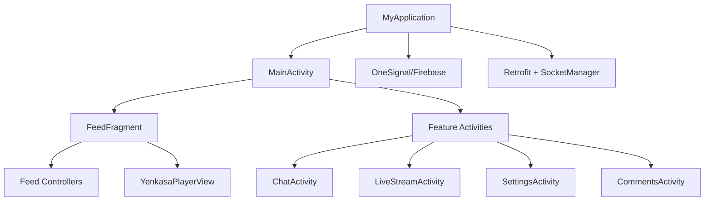

# Android Frontend Architecture

## Overview

The Android client is a single-APK Kotlin application that combines social feed, chat, livestream, rewards, moderation, and settings into one runtime. The app relies on Retrofit for HTTP, Socket.IO for realtime messaging and presence, OneSignal for push delivery, and Media3/ExoPlayer for video playback.

## Current implementation

- `MyApplication`: global bootstrap for locale restore, Retrofit, Firebase, OneSignal, Cloudinary, ads, and notification channels
- `MainActivity`: shell for the authenticated experience and host for `FeedFragment`
- `FeedFragment` + `ui/feed/*`: feed orchestration, caching, socket updates, and player-mode chrome
- `ui/player/*`: custom Yenkasa media surfaces, especially the immersive feed player and reusable video player
- `ui/chat/*`: chat screen plus focused controller classes for socket, media, sound, theme, and permissions
- `LiveStreamsFragment` + `LiveStreamActivity`: livestream discovery and in-room experience
- `SettingsActivity`, `LocaleManager`, `NotificationSoundManager`: user preferences, localization, and notification sound behavior
- `network/*`, `util/*`, `work/*`: API client, socket singleton, token storage, deep links, and background feed sync

## Important modules

- App shell: `MyApplication`, `SplashActivity`, `MainActivity`, `MenuActivity`
- Networking: `ApiClient`, `SocketManager`
- Persistence: `TokenManager`, locale and settings shared preferences
- Media: `YenkasaPlayerView`, `YenkasaVideoPlayerView`, `YenkasaMediaCache`
- Background work: `FeedSyncWorker`

## Known issues

- `MyApplication` carries too many responsibilities and still contains hardcoded third-party credentials
- the app shell uses direct `Intent` navigation instead of a centralized navigation graph
- multiple domains share the same process and preference storage, so app-wide state coupling is high

## Scaling concerns

- feed, livestream, chat, notifications, ads, and rewards are all initialized in one mobile runtime
- custom media surfaces own complex state and lifecycle behavior, which raises regression risk
- singleton socket and token managers are easy to use but make behavior more implicit than explicit

## Future improvements

1. move bootstrap integrations behind dedicated initializers
2. centralize navigation and deep-link routing
3. reduce singleton state in favor of scoped coordinators or repository boundaries
4. move secrets and environment-specific configuration fully out of source
