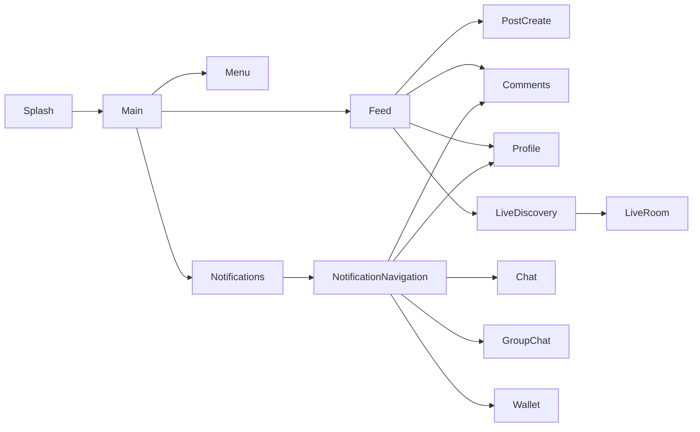

# Android Navigation Structure

## Overview

Yenkasa navigation is activity-centric. `MainActivity` hosts the feed and hands off to specialized activities for chat, comments, profile, livestream, wallet, communities, settings, and moderation-related surfaces.

## Current implementation

- launcher: `SplashActivity`
- authenticated shell: `MainActivity`
- main content host: `FeedFragment`
- side menu and settings surfaces launched with explicit `Intent`s
- deep links are normalized through `AppLinkManager`
- notification taps are mapped through `NotificationNavigation`

## Important routes and entry points

- authenticated startup: `MainActivity`
- feed comments: `CommentsActivity`
- direct chat: `ChatActivity`
- group chat: `GroupChatActivity`
- livestream discovery: `LiveStreamsActivity` / `LiveStreamsFragment`
- livestream room: `LiveStreamActivity`
- profile: `UserProfileActivity`
- settings: `SettingsActivity`
- wallet: `CoinWalletActivity`
- moderation surfaces: `PostApprovalActivity`, `UserRoleDashboardActivity`, web moderation dashboard launch from settings

## Deep links and notification routing

- `MainActivity` handles verified app links for `/post/`, `/user/`, `/community/`, and `/live/`
- `AppLinkManager` canonicalizes Yenkasa URLs and converts them into in-app navigation
- `NotificationNavigation` maps push/in-app payloads into chat, group chat, post comments, profile, ads, community, wallet, approval, or call screens

## Known issues

- no centralized navigation graph or route registry for Android feature ownership
- intent extras are heavily string-based, which increases mismatch risk
- notification routing logic and deep-link routing both understand target URLs, which duplicates responsibility

## Scaling concerns

- adding new destinations requires touching multiple routing layers
- cross-feature flows are easy to break when payload shapes evolve
- activity-heavy navigation increases lifecycle complexity compared with a single-nav-host model

## Future improvements

1. introduce a typed route contract for intents and deep links
2. unify notification and app-link routing behind one destination mapper
3. gradually reduce feature coupling to `MainActivity`
