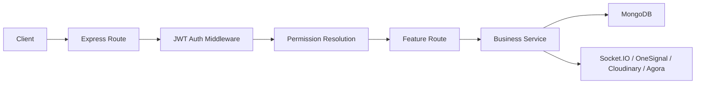

# Backend Architecture

## Overview

The backend is an Express application backed by MongoDB and augmented with Socket.IO for realtime features. It acts as the central authority for identity, feeds, notifications, livestream control, rewards, and moderation.

## Main modules

- `server.js`: bootstrap, route mounting, Socket.IO, Mongo connection, scheduler startup
- `routes/`: API handlers
- `services/`: reusable business flows
- `models/`: persistent entities
- `middleware/`: authentication and authorization checks
- `utils/`: integrations and infrastructure helpers

## Request flow

## Important implementation details

- CORS is permissive and reflects caller origin
- Helmet and compression are enabled
- `cloudinaryMediaResponseOptimizer` rewrites Cloudinary URLs in JSON responses
- route mounting is mostly handled via `safeMount(...)`, but a few routes are mounted directly later in `server.js`
- Mongo connection success triggers permission seeding and scheduler startup

## External dependencies

- MongoDB
- Cloudinary
- OneSignal
- Agora
- Firebase Admin appears in dependencies for broader notification/app integration

## Known issues

- static assets, blog, store pages, API, and realtime share a single process
- route mounting is split across multiple blocks in `server.js`
- some platform behavior depends on process-local maps and timers

## Scaling concerns

- a single process owns all socket presence and livestream room state
- static traffic and API traffic compete for the same runtime
- background schedulers can contend with live traffic during high load

## Future improvements

1. split HTTP API, realtime gateway, and static/store delivery
2. introduce Redis for room state, presence, and dedupe
3. centralize outbound events behind a service boundary

