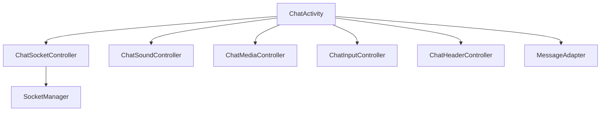

# Chat Client Architecture

## Overview

The chat client supports direct messaging, group chat, media attachments, reactions, calls, rich input, and active-conversation sound behavior. It is still activity-based, but much of the previous single-class complexity has been pushed into domain-specific controllers.

## Current implementation

- `ChatActivity` remains the screen owner
- focused helpers/controllers now handle:
  - realtime socket subscription
  - sound playback
  - media attach/preview
  - input actions
  - permissions
  - message actions
  - theme and header state
  - group-specific behavior
  - call launch behavior
- `ChatSocketController` attaches room-scoped message and presence listeners
- `ChatSoundController` handles in-chat message sounds and laugh-reaction playback with cooldown protection
- `MessageAdapter` renders messages and embedded media

## Important events and behaviors

- join/leave room:
  - `joinChatRoom`
  - `leaveChatRoom`
- realtime message events:
  - `messageCreated`
  - `messageEdited`
  - `messageDeleted`
- presence events:
  - `getOnlineUsers`
  - `userStatusChanged`
  - `presence:update`
- foreground chat notification suppression uses `ChatNotificationState`
- custom in-chat sounds only play when the conversation is visible

## Important modules

- `ui/chat/ChatActivity.kt`
- `ui/chat/ChatSocketController.kt`
- `ui/chat/ChatSoundController.kt`
- `adapter/MessageAdapter.kt`

## Known issues

- `ChatActivity` is still a large lifecycle owner despite the controller split
- chat behavior depends on several singleton services such as token, socket, and call/websocket helpers
- direct and group chat still share overlapping routing and rendering assumptions

## Scaling concerns

- media, calls, sounds, typing, reactions, and socket events all converge in one screen
- listener cleanup must remain strict or message duplication and leaks return quickly
- group chat feature growth will keep pushing more branching logic into the same interaction model

## Future improvements

1. introduce a clearer screen state model for chat rendering
2. formalize chat event contracts shared between push, socket, and REST sync
3. continue moving feature logic out of `ChatActivity` into testable controllers
