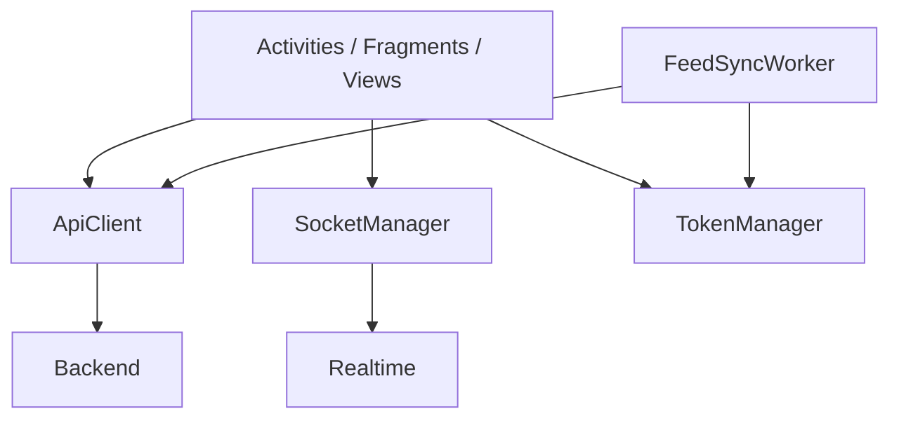

# Client State and Networking

## Overview

The Android client uses Retrofit for HTTP, Socket.IO for realtime events, `EncryptedSharedPreferences` for sensitive local state, and WorkManager for selected background refresh tasks. This gives the app strong offline and reconnect behavior, but also centralizes a large amount of mutable state into singleton helpers.

## Current implementation

- `ApiClient`
  - owns the shared Retrofit instance
  - injects bearer tokens into requests
  - refreshes tokens on `401`
  - registers custom Gson adapters such as `UserBasicJsonAdapter`
- `SocketManager`
  - owns the singleton Socket.IO connection
  - reconnects automatically
  - exposes lightweight `on`, `off`, `emit`, and presence helpers
- `TokenManager`
  - stores auth tokens, refresh token, user profile fragments, roles, OneSignal player id, community selection, and feed cache
  - falls back safely if encrypted preferences become corrupted
- `FeedSyncWorker`
  - refreshes cached feed payloads in the background using selected community names

## Important modules

- `network/ApiClient.kt`
- `network/SocketManager.kt`
- `util/TokenManager.kt`
- `work/FeedSyncWorker.kt`

## Known issues

- `ApiClient` currently uses BODY-level HTTP logging, which is too broad for production risk and payload size
- `SocketManager` is easy to use but makes listener ownership implicit
- `TokenManager` has grown into a catch-all persistence surface

## Scaling concerns

- singleton state makes feature boundaries less clear
- cache format changes require careful invalidation across app updates
- cross-feature reliance on a shared socket increases blast radius when realtime behavior changes

## Future improvements

1. reduce production logging verbosity in the API client
2. split token/auth storage from feature cache storage
3. introduce typed socket subscription helpers per domain
4. version feed and notification caches more explicitly
