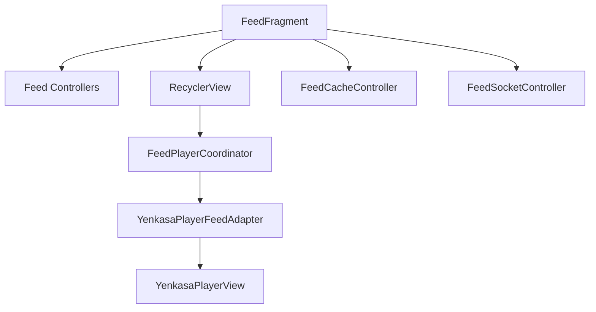

# Feed and Player Frontend

## Overview

The feed is the primary product surface. It is implemented as a fragment-hosted, vertically immersive, player-first experience with supporting chrome for communities, rewards, sponsored ads, and live features.

## Current implementation

- `FeedFragment` owns the visible feed state
- feed responsibilities are split into focused controllers:
  - `FeedTabsController`
  - `FeedCommunityController`
  - `FeedNetworkController`
  - `FeedPostActionsController`
  - `FeedSocketController`
  - `FeedCacheController`
  - `FeedChromeController`
- `FeedPlayerCoordinator` manages the `RecyclerView`, snap behavior, active item playback, and player adapter lifecycle
- `YenkasaPlayerView` is the immersive full-screen feed card
- `YenkasaVideoPlayerView` is the reusable standard video player used outside the main immersive feed

## Important UI behaviors

- player-mode chrome is enabled by default
- community selection scopes feed loading and background sync
- sponsored ads are inserted into the feed experience through monetization helpers
- create-post, wallet, livestream, and live-arena actions are surfaced around the immersive player
- timestamps are rendered from the player item model, with fallback formatting for cached and socket-fed data

## Important modules

- `ui/FeedFragment.kt`
- `ui/feed/*.kt`
- `ui/player/YenkasaPlayerView.kt`
- `ui/player/YenkasaVideoPlayerView.kt`
- `work/FeedSyncWorker.kt`

## Known issues

- `YenkasaPlayerView` owns presentation, interaction, playback, wallet state, and monetization hooks in one class
- feed rendering depends on both network and socket updates, which raises duplication and stale-state risk
- player-mode chrome rules are easy to regress because they touch shared activity controls

## Scaling concerns

- large custom views are harder to test than smaller composable surfaces
- multiple feed controllers reduce `FeedFragment` size, but the feature still relies on many cross-callbacks
- monetization and organic feed behavior remain tightly coupled in the same rendering path

## Future improvements

1. separate media playback logic from feed chrome and engagement chrome
2. define a narrower feed item contract for sockets, cache, and API payloads
3. isolate monetization insertion from the core player coordinator
