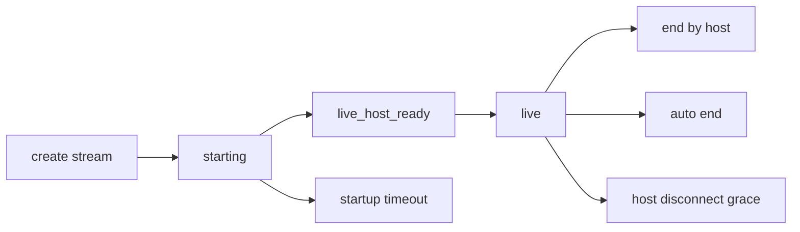

# Livestream Architecture

## Overview

Livestreaming combines REST for session lifecycle and token issuance with Socket.IO for room events and viewer synchronization. Agora is used for media transport, but Yenkasa owns the authorization, room semantics, and business rules.

## Current implementation

### REST lifecycle

- `POST /api/livestream/create`
- `GET /api/livestream/active`
- `POST /api/livestream/join/:id`
- `POST /api/livestream/end/:id`
- `POST /api/livestream/leave/:id`
- `POST /api/livestream/gift`

### Realtime layer

- host becomes live through `live_host_ready`
- host sends `live_host_heartbeat`
- audience joins via `live_join`
- comments and reactions are socket events
- guest seat moderation is also socket-driven

### Persistence

- `models/LiveStream.js` stores lifecycle state, host connection state, viewer counts, guest seats, and duration controls

## Session lifecycle

## Important modules

- `routes/livestream.routes.js`
- `server.js` socket handlers
- `models/LiveStream.js`
- `config/livestreamPermissions.js`
- `utils/agoraTokenGenerator.js`

## Known issues

- lifecycle control is split across HTTP routes and socket handlers
- viewer counts are maintained both by room membership and persisted counters
- startup and disconnect recovery use process-local timers

## Scaling concerns

- host disconnect timers are in-memory and instance-local
- room member counts are not globally coordinated across multiple nodes
- gift transfers and live metadata updates run in the same backend as normal social traffic

## Recommended improvements

1. move livestream lifecycle orchestration behind a dedicated service
2. persist participant state in Redis
3. publish room events through a structured event bus
4. reconcile viewer counts from a single authoritative source

