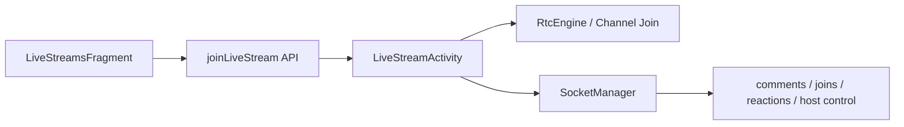

# Livestream Client Architecture

## Overview

The livestream client has two major surfaces: discovery and the live room. Discovery is lightweight and API-driven. The live room is much heavier, combining Agora media, Socket.IO coordination, gifts, reactions, comments, host controls, seat requests, and reconnect behavior.

## Current implementation

- discovery
  - `LiveStreamsFragment` loads active streams from the backend
  - listens for `live_started`, `live_ended`, and `live_removed` to refresh the list
  - gates the start-live button through `UserPermissions.canStartLivestream(...)`
- live room
  - `LiveStreamActivity` reads stream/agora extras
  - requests camera/microphone permissions before Agora start
  - initializes `RtcEngine`
  - joins channel as host or audience
  - uses socket listeners for room comments, reactions, lifecycle, and host/audience coordination

## Important client responsibilities

- validate Agora token, app id, channel, and uid before join
- retry/recover on token expiry and connection loss
- apply runtime permission gating before engine init
- separate host controls from audience actions
- maintain viewer/comment UI while keeping the video surface immersive

## Important modules

- `ui/LiveStreamsFragment.kt`
- `ui/LiveStreamActivity.kt`
- `adapter/LiveStreamAdapter.kt`
- `adapter/LiveGuestAdapter.kt`

## Known issues

- `LiveStreamActivity` remains one of the heaviest activities in the app
- socket ack/retry, timer logic, Agora callbacks, and UI management are still tightly coupled
- role and permission assumptions span both frontend gates and backend enforcement

## Scaling concerns

- reconnect behavior is fragile because media, socket state, and UI state all need to recover together
- livestream UX quality depends heavily on the process staying healthy; there is little isolation
- seat requests, gifting, and moderation features will increase activity complexity further

## Future improvements

1. split Agora session management from room UI orchestration
2. isolate socket room protocol handling into a dedicated coordinator
3. standardize livestream error taxonomy so audience and host failures are easier to diagnose
