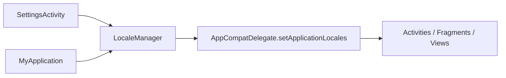

# Localization Client System

## Overview

The Android app now supports runtime language switching using modern AppCompat locale APIs. The current supported languages are English, French, Twi, and Hausa.

## Current implementation

- `LocaleManager`
  - stores a language tag in shared preferences
  - restores language during app startup
  - applies locales through `AppCompatDelegate.setApplicationLocales(...)`
- `MyApplication`
  - restores saved locale before most other app initialization
- `SettingsActivity`
  - exposes the language picker UI
  - updates the summary label for the active language
- manifest
  - uses `android:localeConfig`
  - enables `android:supportsRtl="true"`

## Important modules

- `util/LocaleManager.kt`
- `ui/SettingsActivity.kt`
- `AndroidManifest.xml`
- `res/values*/strings.xml`

## Known issues

- localization infrastructure exists, but full string migration across the app is still incomplete
- some legacy or newly added UI text can still bypass string resources
- domain-specific error parsing often depends on backend English messages

## Scaling concerns

- future language rollout quality depends on completing the hardcoded-string migration
- dynamic feature additions will reintroduce English-only text unless guarded by review discipline
- notification titles and backend-driven copy are only partially localization-aware

## Future improvements

1. complete module-by-module string resource migration
2. lint for hardcoded Android UI strings in Kotlin and XML
3. define translation ownership for backend-provided user-facing messages
