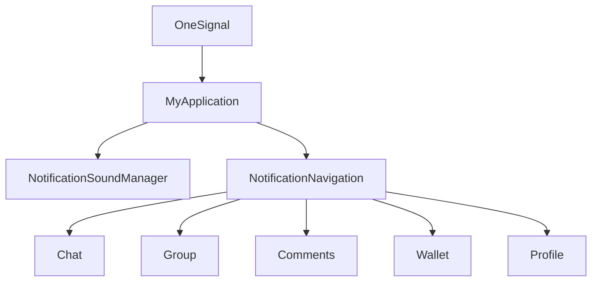

# Notification Client Handling

## Overview

Yenkasa uses OneSignal for push transport, custom Android notification channels for sound selection, and app-specific routing logic to land the user on the correct screen when a notification is opened.

## Current implementation

- `MyApplication`
  - initializes Firebase and OneSignal
  - creates message notification channels
  - intercepts foreground notifications
  - suppresses active-chat duplicates through `ChatNotificationState`
  - builds custom foreground notifications using user-selected sound
- `NotificationSoundManager`
  - stores sound preference
  - creates per-sound channel ids
  - supports preview playback from settings
- `NotificationNavigation`
  - converts notification payloads into explicit intents
  - handles chat, group chat, comments, wallet, profile, ads, communities, approval, and call flows
- `SettingsActivity`
  - exposes notification toggles and sound selection UI

## Important payload types

- chat message notifications
- reward notifications
- community post notifications
- call invites
- post/comment activity
- moderation and approval-related events

## Known issues

- push handling logic is spread across app bootstrap, settings, routing, and chat suppression helpers
- OneSignal configuration is still source-coded rather than fully environment-scoped
- channel migration logic can become brittle when sound ids or channel ids change

## Scaling concerns

- notification type growth increases routing complexity quickly
- payload mismatch between backend and Android can silently route users to the wrong surface
- multiple notification preference sources must remain aligned with backend expectations

## Future improvements

1. centralize notification payload schema validation
2. reduce notification-specific branching inside `MyApplication`
3. add stronger analytics around push delivery, suppression, and open routing
