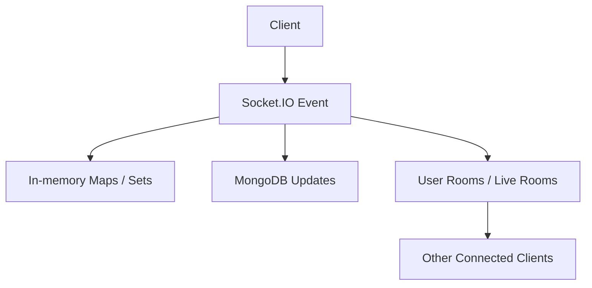

# Socket.IO Realtime System

## Overview

Socket.IO powers:

- online/offline presence
- chat room membership
- chat laugh reaction events
- livestream rooms, comments, reactions, guest seat actions, and viewer counts
- notification fan-out through user-specific rooms

## Current implementation

- Socket.IO is created in `server.js`
- each user joins a room keyed by their user id after `userConnected`
- online presence is tracked in in-memory `Map` objects
- livestream rooms use two room names for backward compatibility:
  - `livestream_<streamId>`
  - `live:<streamId>`

## Important socket events

### Presence

- `userConnected`
- `userOnline`
- `userOffline`
- `requestOnlineUsers`
- outbound: `getOnlineUsers`, `userStatusChanged`

### Chat

- `joinChatRoom`
- `leaveChatRoom`
- `chat_laugh_reaction`

### Livestream

- `live_host_ready`
- `live_host_heartbeat`
- `live_join`
- `live_leave`
- `live_comment`
- `live_reaction`
- `live_request_guest_seat`
- `live_approve_guest_seat`
- `live_decline_guest_seat`
- `live_mute_guest`
- `live_kick_guest`
- outbound: `live_room_joined`, `live_viewer_count`, `live_ended`, `live_started`, guest seat events

## Event flow

## Known issues

- presence, dedupe, and room participant state are stored in process memory
- no Redis adapter or distributed room state exists
- reconnect semantics are partially handled with timers rather than a shared store

## Scaling concerns

- multi-instance deployment will fragment presence and livestream membership
- process restarts lose in-memory dedupe windows and presence state
- high fan-out live events still depend on a single socket gateway process

## Recommended improvements

1. add Redis adapter for Socket.IO
2. move presence and livestream participant state to Redis
3. formalize event schemas and versioning
4. capture metrics for room size, emit latency, and reconnect churn

