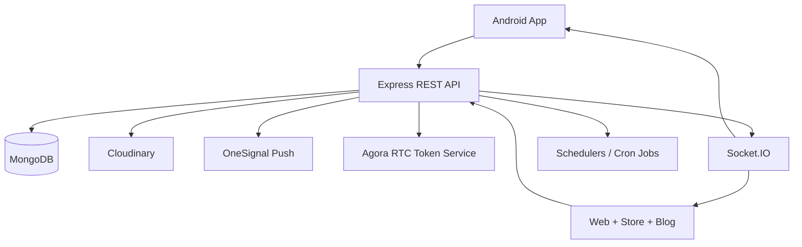

# System Overview

## Overview

Yenkasa runs as a single Node.js backend that combines:

- REST APIs
- Socket.IO realtime messaging
- livestream orchestration
- wallet and reward logic
- moderation and approval workflows
- static web/store/blog hosting

The backend is functionally rich but structurally centralized. Most cross-cutting platform behavior converges in `server.js`, shared Mongoose models, and a handful of services.

## High-level architecture

## Core platform domains

- Identity and access: registration, login, JWT auth, role evaluation
- Social graph: users, follows, communities, privacy relationships
- Content: posts, comments, likes, shares, feeds, approvals
- Realtime: chat presence, room membership, livestream events
- Monetization and rewards: YKC accrual, transfers, live gifts, analytics snapshots
- Moderation: post approvals, reports, suspensions, role-based review actions

## Important implementation characteristics

- Express 5 + Mongoose + Socket.IO
- `global.io` is used so route handlers can emit realtime updates
- Cloudinary URLs are optimized through a JSON response middleware
- OneSignal is used for push delivery
- Agora token generation is server-side
- node-cron runs daily and monthly jobs in-process

## Known system constraints

- horizontal scaling is limited by in-memory socket and livestream state
- the API, static web, store pages, and realtime server share one process
- some read endpoints also perform write side effects
- permission logic exists in multiple layers with overlapping role concepts

## Recommended next steps

1. split platform concerns into API, realtime, and static-delivery services
2. move shared runtime state to Redis or another distributed store
3. standardize role evaluation behind one authoritative module
4. isolate scheduled jobs from the request-serving process

