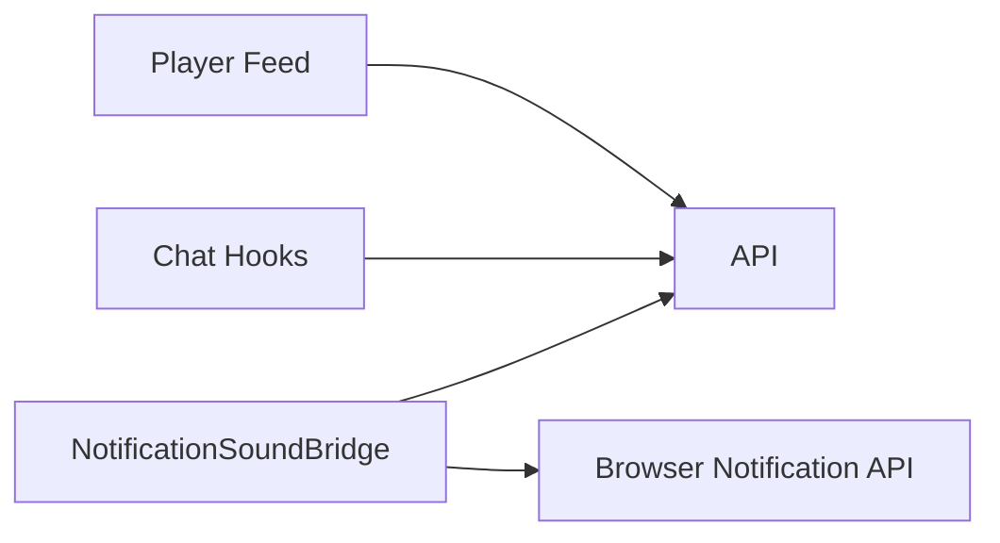

# Web Feed, Chat, and Notifications

## Overview

The web client reproduces the main social product loops in the browser: immersive feed, browser-based chat, and notification handling. These systems are independent React implementations, not thin wrappers around the Android logic.

## Feed and player

- `Home.jsx` can render either:
  - a classic feed surface, or
  - the immersive player feed through `YenkasaWebPlayerFeed`
- `YenkasaWebPlayerFeed`
  - loads feed pages from `/api/feed` or community post endpoints
  - injects ad slots on a fixed interval
  - tracks active post card via `IntersectionObserver`
  - merges appended pages client-side
- `YenkasaWebPlayerCard`
  - handles video, audio, image, and text posts
  - keeps viewed-post ids in local storage
- player controls persist mute/volume state in browser storage and broadcast mute changes via window events

## Chat

- `ChatPage` is route-driven using `/chatrooms/:roomId`
- chat logic is split across:
  - `useChat`
  - `useChatData`
  - `useChatComposer`
- the web chat stack is hook-based rather than socket-controller-based like Android
- the current chat surface supports:
  - room list + thread view
  - reply gestures
  - media picking
  - browser audio recording where supported
  - chat background customization via local storage

## Notifications

- `NotificationSoundBridge`
  - polls notifications every 10 seconds
  - tracks unread ids client-side
  - plays the selected sound for newly discovered unread items
  - attempts browser notifications when permission is granted
- `notificationRouting.js`
  - maps payloads into SPA routes
  - handles chat, groups, wallet, ads, communities, approvals, profile, posts, and comments

## Known issues

- notifications are polling-based, not socket-driven
- chat behavior depends on browser capability checks and local storage conventions
- feed ranking and dedupe are client-owned and can drift from Android logic

## Scaling concerns

- polling notifications every 10 seconds for active sessions does not scale as cleanly as push/socket delivery
- browser media policies make sound and recording behavior less predictable than on Android
- duplicated feed ranking and visibility rules across platforms raise consistency risk

## Future improvements

1. move web notifications from polling toward push or socket subscription
2. define shared feed-ranking and post-normalization contracts across platforms
3. consolidate chat state and delivery semantics behind a more explicit realtime layer
