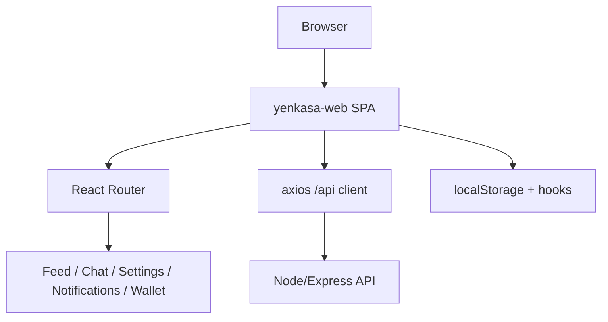

# Web Frontend Architecture

## Overview

The Yenkasa web client is a Vite + React single-page application that mirrors core mobile product areas: feed, chat, notifications, wallet, profile, communities, moderation, and settings. It is built as a browser-first companion surface rather than a separate backend-owned application stack.

## Current implementation

- runtime: React 18 + React Router
- build tool: Vite
- HTTP layer: `axios` with a lightweight `/api` client
- localization: in-app `LocaleContext`
- auth model: token stored in browser local storage
- deployment: built into `yenkasaChatBackend/RegLoginBackend/public/yenkasa_web`
- mount path: `/web`

## Main modules

- `src/main.jsx`: bootstraps `BrowserRouter` and locale provider
- `src/App.jsx`: route map and auth gating via `ProtectedRoute`
- `src/api/*`: feature-scoped API wrappers
- `src/pages/*`: page-level product surfaces
- `src/components/*`: reusable UI pieces, especially feed, player, chat, and notifications
- `src/hooks/*`: async, chat, and notification helpers
- `src/utils/*`: storage, permissions, notification routing, formatting, media helpers

## Important routes

- `/`: authenticated home feed
- `/chatrooms` and `/chatrooms/:roomId`
- `/notifications`
- `/settings`
- `/profile` and `/profile/:userId`
- `/wallet`
- `/create-post`
- `/post/:postId`
- `/post-approvals`
- `/admin/economy`

## Known issues

- auth uses browser local storage directly rather than a stronger session abstraction
- client-side permissions are simpler than Android and backend permissions
- multiple placeholder routes still exist, which means the route map is ahead of implementation in several areas

## Scaling concerns

- browser state is spread across hooks, page state, and local storage conventions
- polling and browser-notification bridges can grow noisy as more realtime behavior is added
- several product behaviors are implemented separately from Android, increasing platform drift

## Future improvements

1. centralize session and token lifecycle handling
2. formalize typed API contracts instead of route-by-route wrappers
3. reduce placeholder pages by aligning route inventory with actually supported features
