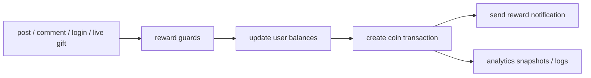

# YKC Reward System

## Overview

YKC is the platform reward and balance system used for:

- content rewards
- account-age and activity incentives
- live gifts and transfers
- wallet history and analytics

The backend currently treats YKC as both a ledgered transaction stream and a denormalized user balance.

## Current implementation

### Core reward path

- `services/reward.service.js`
- validates user and reward amount
- normalizes reward values through `ykcEconomy.service.js`
- enforces guardrails such as duplicate activity checks and country reward caps
- updates `coinsBalance`, `ykcBalance`, and monthly earned totals
- records a `CoinTransaction`
- creates a reward notification

### Scheduled economy maintenance

- `services/verificationScheduler.js`: grants daily account activity rewards
- `services/ykcMonthlyReset.js`: snapshots and resets monthly YKC counters

### Live gifting

- `POST /api/livestream/gift`
- transfers YKC from audience to host inside a Mongo session

## Important modules

- `services/reward.service.js`
- `services/ykcEconomy.service.js`
- `services/ykcMonthlyReset.js`
- `models/cointransaction.model.js`
- `models/coinSupply.js`

## Data flow

## Known issues

- balance fields and ledger entries are both authoritative in different parts of the code
- reward logic depends on many related services and helper functions
- reward issuance happens in normal request paths and scheduler loops

## Scaling concerns

- daily verification/reward jobs iterate every user
- reward analytics and notifications add extra writes per reward event
- repeated reward checks can become expensive as user and activity volume grows

## Recommended improvements

1. define the ledger as the single source of truth and derive balances safely
2. move large reward campaigns and recurring grants to background workers
3. expose explicit reward reason codes and metrics for analytics

